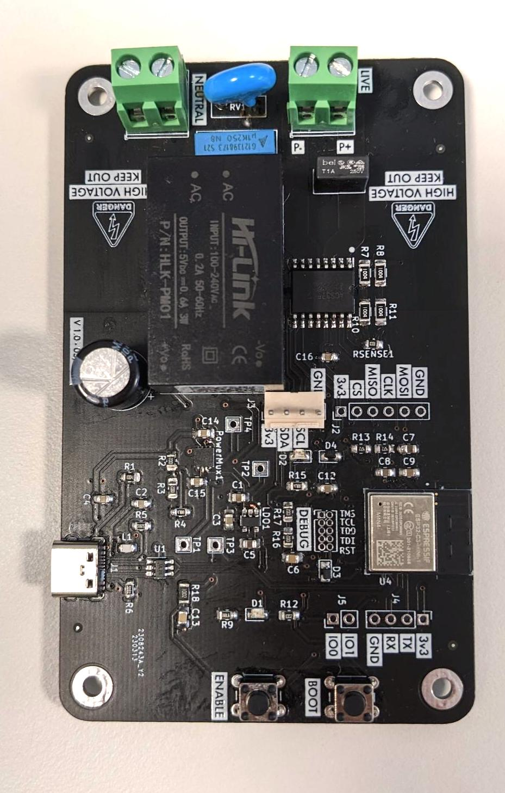

# Smart AC Power Meter based on ESP32-C3 module
***

> **⚠ WARNING: Project still in progress.**  
> This project is still under development. However, I have successfully tested the following features: 
***
- Flashing and debugging the ESP32 module via USB-C ✅
- Blink the LED on GPIO pin 0 ✅
- I2C communication with the ACS37800 IC (read and write registers) ✅
- Fixed a schematic/hardware bug in the power switch logic (not shown in the image below) ✅
***

